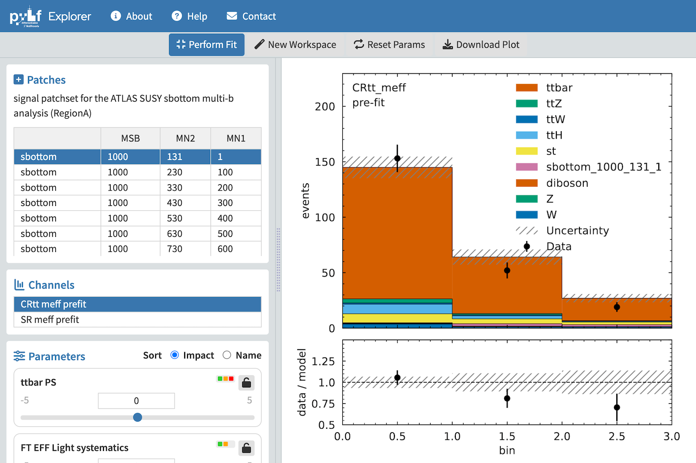

<p align="center">
	<div align="center">
		
	</div>
</p>

# HF Explorer

HF Explorer is a web based viewer for high energy particle physics that allows users to view various types of plots from data formatted as HistFactory workspaces.

If you are working with HistFactory formatted data, HF Explorer provides an easy-to-use and convenient way to generate plots, perform fits, and to investigate the impact of various parameters on the model performance.

<div align="center">
    
    <div><i>HF Explorer</i></div>
</div>

## Installation

This application depends upon the following utilities which will need to be installed before you can run the application:

- [Flask](https://flask.palletsprojects.com/en/2.3.x/installation/)

Flask is used for the back end web services.

```
pip install Flask

```

- [pyhf](https://scikit-hep.org/pyhf/installation.html):

pyhf is used to read and manage HistFactory data in JSON format.

```
python -m pip install pyhf
```

- [cabinetry](https://pypi.org/project/cabinetry/):

Cabinetry is used to perform parameter fits.

```
python -m pip install cabinetry
```

- [jq](https://jqlang.github.io/jq/download/):

Jq is a utility for managing JSON patch files.

```
brew install jq
```

## Configuration

The application configuration is handled by the top level Flask python file: services/app.py.

```
################################################################################
#                             app configuration                                #
################################################################################

app.config['UPLOAD_FOLDER'] = os.path.join(app.root_path, 'public/workspaces')
app.config['APP_JQ'] = '/opt/homebrew/bin/jq'
app.config['DEBUG'] = False
app.config['HOST'] = 'localhost'
app.config['PORT'] = '5000'

```

- UPLOAD_FOLDER

This is where the user workspaces are uploaded to.  By default, it is set to the folder (local to this application):
```
/public/workspaces 
```

You can optionally change this to be somewhere else if you'd like.

- APP_JQ

This is the path to the jq utility app.  On MacOS, it is located in
```
/opt/homebrew/bin/jq
```
If you are running on another operating system, then you will need to set this accordingly.  On most linux systems, this path should be set to 'user/bin'.

- DEBUG

This is the debugging state for Flask and determines how error messages are displayed.  If you are running locally, then you can set this to True for detailed error messages.  When you deploy to production, then you should set this to False.

- HOST

This is the host that the server runs on.  For local development, this is set to "localhost".  When you deploy to another server, then you should set this to that server's hostname or IP address.

- PORT

This is the port that the server runs on.  It is set to 5000 by default but if you are running the application on a public web server then you will want to change this to 80 for HTTP or 443 for HTTPS.  Note: To run on port 80 or 443, you will need to have root access priveleges.

## Running

After you have configured the server, you can start the server with the following command:

```
python3 app.py
```

After starting the server, to run the application, open your web browser to:

```
http://localhost:5000
```

## Documentation

View the [Help](http://www.hepexplorer.net/#help) page for details of how to use the application.

<!-- LICENSE -->
## License

Distributed under the permissive MIT license. See the [license](./LICENSE.txt) for more information.

<!-- Acknowledgements -->
## Acknowledgements

This software was created by the [American Family Insurance Data Science Institute](https://datascience.wisc.edu/) at the [University of Wisconsin-Madison](https://www.wisc.edu/) under a grant from [IRIS Hep](https://iris-hep.org/)